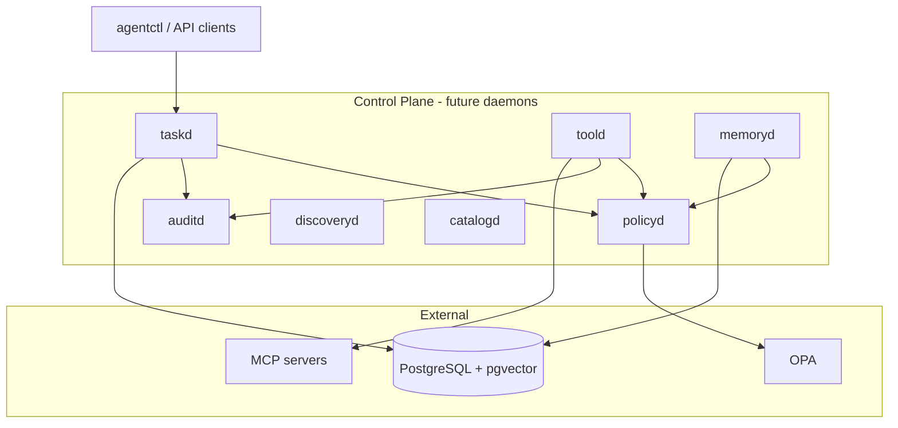

# AgentOS Architecture

AgentOS v0.1 is a policy-first agent runtime control plane built with Clean Architecture.

## Control plane

## Clean Architecture layers

| Layer | Location | Foundation status |
|-------|----------|-------------------|
| Domain | `internal/domain/` | Entities, state machines, invariants |
| Ports | `internal/port/` | Repository and service interfaces |
| Use cases | `internal/usecase/` | Service contracts (no implementations) |
| Adapters | `cmd/`, future `internal/adapter/` | Deferred — placeholder binaries only |
| Contracts | `api/`, `proto/`, `migrations/` | OpenAPI, JSON Schema, protobuf, SQL |

Dependency rule: outer layers depend on inner layers; domain has zero infrastructure imports.

## Architectural principles

1. **Task-first orchestration** — all work flows through `taskd`
2. **Tool syscall boundary** — agents never call MCP servers directly
3. **Memory and catalog separation** — governed memory vs operational graph
4. **Security-by-substrate** — policy, ACL, and audit enforced outside the agent prompt
5. **Safe discovery** — read-only collectors only; no network reconnaissance in v0.1

## Deferred components

- `agentd` and Hermes runtime adapters
- HTTP/gRPC server implementations
- Nix flakes and NixOS modules
- Vault integration and Qdrant vector backend

## Next vertical slices

1. AuditD — append-only hash chain
2. PolicyD — OPA REST wrapper
3. TaskD — state machine + SSE
4. ToolD — MCP gateway
5. MemoryD — pgvector hybrid search
