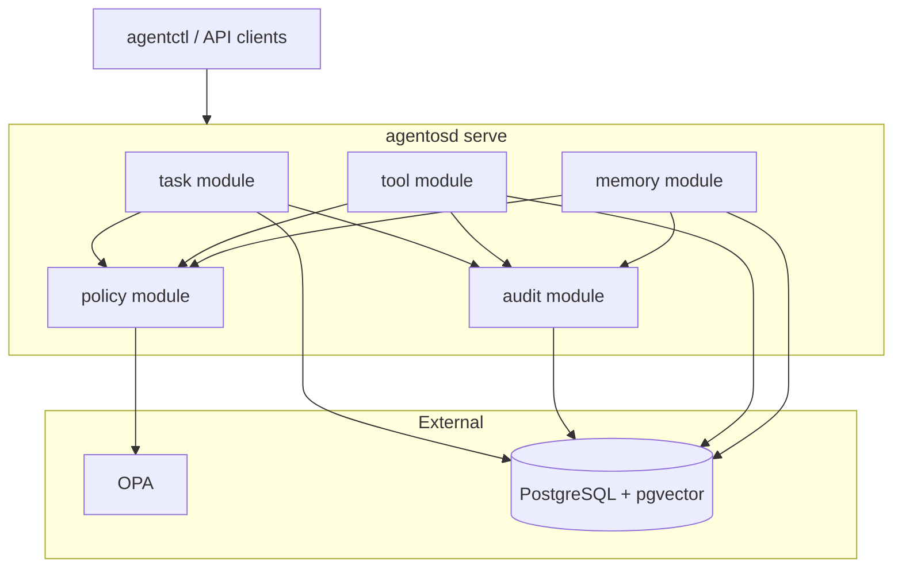

# AgentOS Architecture

AgentOS is a policy-first agent runtime control plane built with Clean Architecture.

## Control plane (v0.2)

## Clean Architecture layers

| Layer | Location | v0.2 status |
|-------|----------|-------------|
| Domain | `internal/domain/` | Entities, state machines, invariants |
| Ports | `internal/port/` | Repository and service interfaces |
| Use cases | `internal/usecase/` | Northbound service contracts |
| Modules | `internal/module/` | Application service implementations |
| Adapters | `internal/adapter/` | Postgres, OPA, memory, builtin tools |
| Entry | `cmd/agentosd`, `cmd/agentctl` | HTTP server and CLI |

Dependency rule: outer layers depend on inner layers; domain has zero infrastructure imports.

## Architectural principles

1. **Task-first orchestration** — work flows through TaskD
2. **Tool syscall boundary** — agents invoke tools via ToolD, not directly
3. **Memory and catalog separation** — governed memory vs operational graph
4. **Security-by-substrate** — policy, ACL, and audit enforced outside the agent
5. **Safe discovery** — read-only collectors only; no network reconnaissance in foundation

## Deferred components

- `agentd` and Hermes runtime adapters (v0.3)
- Split daemon deployment (v0.4+)
- Nix flakes and NixOS modules
- Vault integration and Qdrant vector backend
- Production OIDC (v0.2 uses dev auth stub)

See [ADR-0002](adr/0002-monolith-first-daemon.md) for monolith-first rationale.
